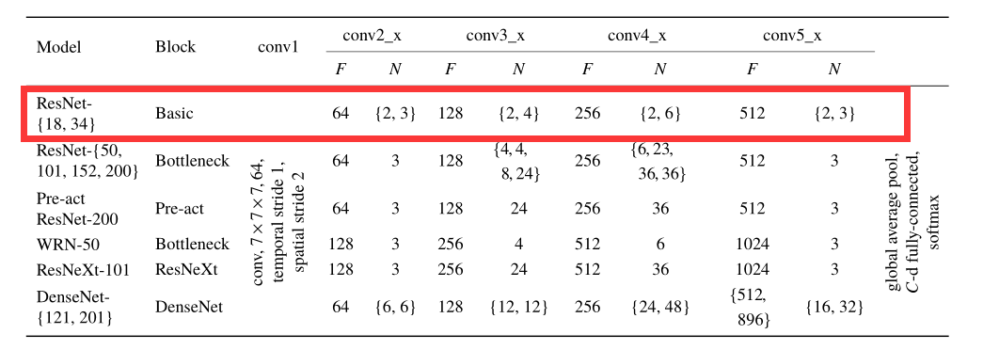

# Reproduction of paper "Can Spatiotemporal 3D CNNs Retrace the History of 2D CNNs and ImageNet?"

##  Reproduction based on [PaddleVideo](https://github.com/PaddlePaddle/PaddleVideo)

# 一、简介
  
网络结构如图所示，本论文的目的是检验当前的视频数据集是否可以用于训练非常深的3D卷积网络。本项目的结构是ResNet18（如红框所示），目标是UCF101分类准确率达到42.4%。

论文：
- [1] Kensho Hara, Hirokatsu Kataoka, Yutaka Satoh. [Can Spatiotemporal 3D CNNs Retrace the History of 2D CNNs and ImageNet?](https://paperswithcode.com/paper/can-spatiotemporal-3d-cnns-retrace-the)

代码参考:
-[https://github.com/kenshohara/3D-ResNets-PyTorch/tree/CVPR2018](https://github.com/kenshohara/3D-ResNets-PyTorch/tree/CVPR2018)

# 二、复现精度
在UCF101验证集上:

|model|acc|
|:---:|:---:|
|3d-resnet|43.98%|

# 三、数据集
UCF101

# 四、环境依赖
- 硬件：Tesla V100 * 1
- 框架：PaddlePaddle==2.2.1

# 五、快速开始
本项目基于PaddleVideo开发，使用方法和PaddleVideo完全一致  
该项目提供了[NoteBook](https://aistudio.baidu.com/aistudio/projectdetail/3034369?contributionType=1)版本，带有权重，可快速体验。  
## 第一步：克隆本项目
```bash
git clone https://github.com/justld/3D-ResNets_paddle
```
### 安装第三方库
```bash
pip install -r requirements.txt
```

## 第二步：准备数据
参考[UCF101数据准备](https://github.com/PaddlePaddle/PaddleVideo/blob/develop/docs/zh-CN/dataset/ucf101.md)

## 第三步：训练
训练需要一个小时左右，可以很快得到训练结果.  
[权重下载 提取码：9exc](https://pan.baidu.com/s/1USBWBLpFHKRUVI4NVQxAGA)
```bash
python3 main.py -c configs/recognition/resnet18_3d/resnet18_3d_ucf101_frames.yaml --validate --seed=10001 
```

## 第四步：验证
```bash
python3 main.py -c configs/recognition/resnet18_3d/resnet18_3d_ucf101_frames.yaml --test -w {path to pdparams}
```


## 第五步：导出预测
先导出模型，然后预测
```bash
python3.7 tools/export_model.py -c configs/recognition/resnet18_3d/resnet18_3d_ucf101_frames.yaml -p {path to pdparams} -o inference/Res18_3D

python3.7 tools/predict.py --config configs/recognition/resnet18_3d/resnet18_3d_ucf101_frames.yaml --input_file {path to avi} --model_file inference/Res18_3D/Res18.pdmodel --params_file inference/Res18_3D/Res18.pdiparams --use_gpu=True --use_tensorrt=False
```

in
# 五、模型信息

|信息|描述|
|---|---|
|作者|郎督|
|框架版本|PaddlePaddle==2.2.1|
|在线体验|[notebook](https://aistudio.baidu.com/aistudio/projectdetail/3034369?contributionType=1)|


